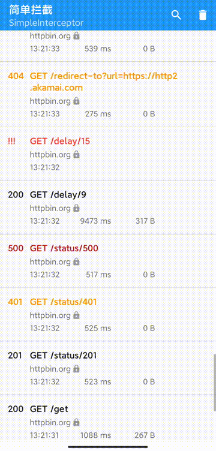

# SimpleInterceptor

SimpleInterceptor はAndroid OkHttpクライアントのブロッキングインターフェースツールであり、テストや開発を容易にし、問題を迅速に検索するためです。




## 要求
1. Android 4.1+
2. OkHttp 3.x or 4.x
3. androidx

**警告**：

> このブロッカーを使用して生成および格納されたデータは、認証またはCookieヘッダ、および要求および応答本体の内容などの敏感な情報を含むことができる。

  これにより、デバッグプロセスにしか使えず、オンラインに投稿できない。

設定
バージョンはokhttp関連：

appが統合されているのがokhttp 3.+バージョンの場合は3.0バージョンのコードを選択してください。

appが統合されているのがokhttp 3.+バージョンの場合は4.0バージョンのコードを選択してください。
```

okhttp3 3.+
dependencies {

    debugImplementation 'com.github.smartbackme.SimpleInterceptor:simpleinterceptor-debug:3.0'
    releaseImplementation 'com.github.smartbackme.SimpleInterceptor:simpleinterceptor-release:3.0'
}
or

okhttp3 4.+
dependencies {

    debugImplementation 'com.github.smartbackme.SimpleInterceptor:simpleinterceptor-debug:4.0'
    releaseImplementation 'com.github.smartbackme.SimpleInterceptor:simpleinterceptor-release:4.0'
}

```

使用：

```

OkHttpClient.Builder()
            .addInterceptor(SimpleInterceptor(context))
            .build()
```

礼を述べる

----------------

SimpleInterceptor は以下のオープンソースライブラリを使用します。

okhttp，gson，cupboard

プロジェクトは新版のok http，androicx，kotlinに適応するために、

プロジェクト改編は [https://github.com/jgilfelt/chuck](https://github.com/jgilfelt/chuck)

License
-------

    Copyright (C) 2017 Jeff Gilfelt.

    Licensed under the Apache License, Version 2.0 (the "License");
    you may not use this file except in compliance with the License.
    You may obtain a copy of the License at

       http://www.apache.org/licenses/LICENSE-2.0

    Unless required by applicable law or agreed to in writing, software
    distributed under the License is distributed on an "AS IS" BASIS,
    WITHOUT WARRANTIES OR CONDITIONS OF ANY KIND, either express or implied.
    See the License for the specific language governing permissions and
    limitations under the License.