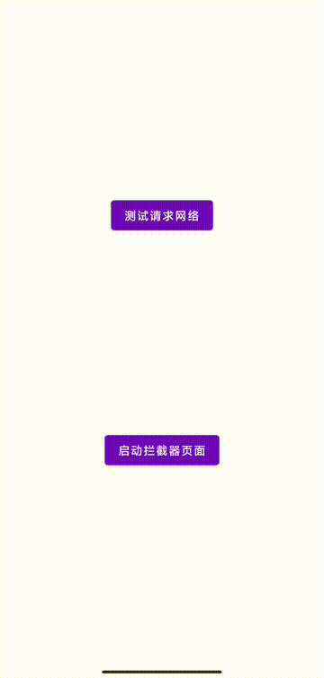
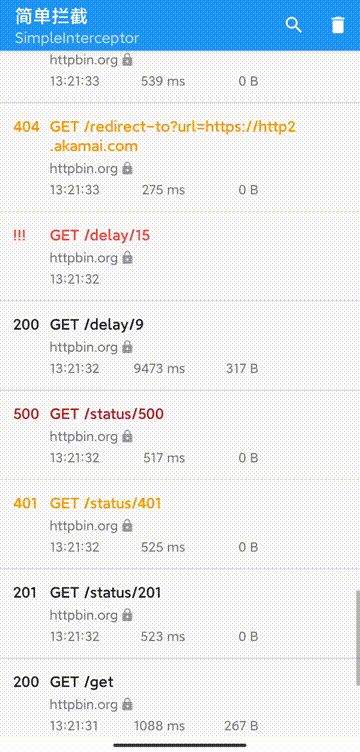

# SimpleInterceptor

SimpleInterceptor 是Android OkHttp客户端的的拦截接口工具，为的是方便测试或开发，快速查找问题。




## 环境要求
1. Android 4.1+
2. OkHttp 3.x or 4.x
3. androidx

**警告**：

> 使用此拦截器时生成和存储的数据可能包含敏感信息，如授权或Cookie头，以及请求和响应主体的内容。
由此，其只能用于调试过程，不可发布到线上

配置
版本于okhttp关联：
如果app 集成的是okhttp3 3.+版本那么请选用 3.0版本代码
如果app 集成的是okhttp3 4.+版本那么请选用 4.0版本代码

```
okhttp3 3.+
dependencies {

    debugImplementation 'com.github.smartbackme.SimpleInterceptor:simpleinterceptor-debug:3.0'
    releaseImplementation 'com.github.smartbackme.SimpleInterceptor:simpleinterceptor-release:3.0'
}
or

okhttp3 4.+
dependencies {

    debugImplementation 'com.github.smartbackme.SimpleInterceptor:simpleinterceptor-debug:4.0'
    releaseImplementation 'com.github.smartbackme.SimpleInterceptor:simpleinterceptor-release:4.0'
}
```

使用：

```

OkHttpClient.Builder()
            .addInterceptor(SimpleInterceptor(context))
            .build()
```

致谢

----------------

SimpleInterceptor 使用以下开源库：

okhttp，gson，cupboard

为了项目适应于新版的okhttp，androicx，kotlin，

项目改编自 [https://github.com/jgilfelt/chuck](https://github.com/jgilfelt/chuck)

License
-------

    Copyright (C) 2017 Jeff Gilfelt.

    Licensed under the Apache License, Version 2.0 (the "License");
    you may not use this file except in compliance with the License.
    You may obtain a copy of the License at

       http://www.apache.org/licenses/LICENSE-2.0

    Unless required by applicable law or agreed to in writing, software
    distributed under the License is distributed on an "AS IS" BASIS,
    WITHOUT WARRANTIES OR CONDITIONS OF ANY KIND, either express or implied.
    See the License for the specific language governing permissions and
    limitations under the License.